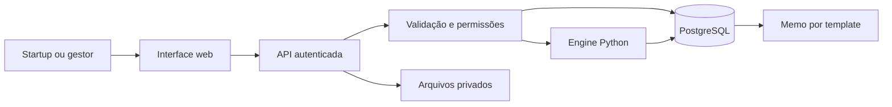

# Angel Market — escopo e plano de implementação

Versão: 0.4 — documento de trabalho, 12/09/2026.

Responsável pela definição: fundador, com apoio de planejamento nesta conversa.

Este documento consolida o briefing fornecido e será atualizado a cada decisão relevante. O trabalho autorizado nesta etapa é planejar e documentar; a implementação do produto não foi iniciada. A pasta do projeto estava vazia na leitura inicial.

**Convenções:** CONFIRMADO = requisito explícito do briefing; PROPOSTO = recomendação para discussão; EM ABERTO = depende de informação do fundador ou validação externa. Metas, preços e estimativas abaixo são hipóteses de planejamento, não resultados observados nem cotações de mercado.

## 1. Direção e proposta de valor

**Proposta de valor proposta após pesquisa:** ajudar startups SaaS e suas incubadoras a descobrir quanto podem comprometer, quando precisam rever o plano e quais mudanças preservam o caixa até o próximo marco, mesmo sob condições adversas explicitamente avaliadas.

CONFIRMADO: produto B2B de suporte quantitativo à decisão; startup como usuária e fornecedora permissionada de dados; instituição como hipótese de comprador. Equipe pequena, cloud simples, importação manual e valor antes de um grande histórico. LLM não será o motor matemático.

PROPOSTO: começar pela decisão “quais gastos e contratações cabem no nosso caixa nos próximos 12–18 meses?”. Entregar uma comparação entre plano atual, adiamento de contratações e ajuste de despesas, mostrando o custo e as hipóteses de receita de cada alternativa.

**Tese de diferencial a validar:** planejamento de decisões robustas com poucos dados, vinculado a um marco operacional e revisado mensalmente com o realizado. Iniciar por limites de compromisso e testes de estresse reversos; aprender parâmetros preditivos quando houver evidência. A investigação e o desenho do diferencial estão na seção 21. O fundador pediu a busca desse diferencial; ainda não confirmou esta proposta como posicionamento final.

O produto deve ser melhor que a planilha atual em rastreabilidade, atualização recorrente e comparação de alternativas. A presença de simulação ou IA, isoladamente, não valida a diferenciação.

### 1.1 Decisões e pendências

| ID | Tema | Estado | Direção atual / informação necessária |
|---|---|---|---|
| D01 | Natureza do trabalho atual | CONFIRMADO | Planejar e manter este `.md` ao longo da conversa. |
| D02 | Núcleo inicial | CONFIRMADO | Modelagem financeira e cenários; evolução probabilística gradual. |
| D03 | Mercado inicial | CONFIRMADO | Brasil, Paraná; fundador é estudante ligado à incubadora local da UTFPR. Campus, interlocutor e orçamento ainda desconhecidos. |
| D04 | Segmento das startups | CONFIRMADO | Começar com SaaS B2B com receita recorrente; confirmar se há grupo compatível no parceiro. |
| D05 | Entrada prioritária | CONFIRMADO | UTFPR; contatos prévios também com Sebrae e Centelha/Fundação Araucária. Ninguém solicitou piloto até agora; demanda e comprador ainda não validados. |
| D06 | Dados disponíveis | EM ABERTO | Campos, qualidade, periodicidade e meses de histórico reais. |
| D07 | Capacidade de execução | CONFIRMADO | Codex conduz implementação; fundador conhece programação e finanças quantitativas, revisa e opera com cerca de 4–5 h/semana, eventualmente mais. Orçamento mínimo, valor ainda indefinido. |
| D08 | Stack | PROPOSTO | Primeiro motor Python e interface local simples; FastAPI/PostgreSQL/interface web após confirmação do piloto e necessidade de acesso independente. |
| D09 | Marco de entrega | PROPOSTO | Primeiro uso assistido com 5 empresas; expandir até 20 após resolver importação e utilidade. |
| D10 | Uso secundário de dados | EM ABERTO | Direitos e finalidades de pesquisa, benchmarks e treinamento, separados do serviço principal. |
| D11 | Forma da primeira entrega | CONFIRMADO | Proposta clara de piloto e, preferencialmente, demo funcional. Data da conversa ainda não informada. |
| D12 | Expectativa de predição inicial | EM ABERTO | Fundador quer discutir diferença entre projeção, simulação e previsão aprendida antes de decidir; ver seção 16. |
| D13 | Diferencial principal | PROPOSTO | Limites de decisão e planejamento robusto até um marco, com aprendizado longitudinal; validar contra ferramentas atuais e alternativas. |

Atualização do fundador: possui Codex Plus e prevê usar modelos como GPT 5.6 Sol em High para desenvolver. Essa é uma preferência de execução futura; não determina que o produto precisará de um LLM em produção. O planejamento não pressupõe trabalho autônomo contínuo entre sessões. A economia com geração de código não elimina revisão, validação quantitativa, atendimento ao piloto ou custos de operação.

**Leitura rápida:** a proposta imediata está na seção 15; a diferença entre abordagens quantitativas, na seção 16; o plano de execução, na seção 17; a pesquisa Brasil/Paraná, na seção 20; e a tese de diferencial, na seção 21. A pesquisa encontrou concorrentes e alternativas relevantes: escassez ampla de inteligência de negócios não está demonstrada. A hipótese a validar é uma lacuna de adequação e acesso para SaaS early-stage acompanhadas por instituições.

## 2. ICP e estratégia de entrada

PROPOSTO: começar pela incubadora/aceleradora acessível ao fundador, verificando se acompanha financeiramente startups e consegue recrutar pelo menos 5 empresas SaaS B2B com receita e interesse numa decisão real. Uma instituição com 10–50 startups é uma hipótese de canal; não é uma exigência para o primeiro parceiro. O primeiro grupo analítico deve compartilhar modelo de negócio e definições de métricas.

Usuário da startup: fundador ou responsável financeiro. Usuário institucional: gestor de portfólio ou analista. Comprador: patrocinador com orçamento identificado. Esses papéis podem ser pessoas diferentes.

| Segmento | Hipótese favorável | Risco a validar | Prioridade proposta |
|---|---|---|---|
| Aceleradora com acompanhamento ativo | Reuniões recorrentes e acesso a várias empresas | Dados irregulares e orçamento limitado | Alta se houver patrocinador acessível |
| Micro-VC | Decisões de acompanhamento e capital mais frequentes | Segurança, confiança e ferramentas existentes | Alta se houver acesso direto |
| Incubadora universitária | Acesso institucional e pesquisa aplicada | Contratação lenta, empresas pré-receita e variedade de modelos | Boa para piloto se o grupo for compatível |
| Angel syndicate | Proximidade de founders | Responsabilidade operacional dispersa | Posterior, salvo parceiro concreto |
| CVC | Potencial de contrato maior | Compras, segurança e customizações podem exceder o MVP | Adiar como padrão |
| Programa de funding | Turmas e prestação de contas | Uso episódico e dependência de edital | Oportunidade específica |

Esta comparação é uma avaliação estratégica a validar em entrevistas, não uma pesquisa de mercado concluída. Um parceiro interessado não prova disposição de pagar. Trazer 50 empresas também pode aumentar onboarding e suporte; redução de CAC é hipótese, não consequência automática.

Qualificar o parceiro por: acesso efetivo às startups; decisão recorrente; responsável operacional; orçamento e processo de compra; disponibilidade de dados; limites de compartilhamento. Não iniciar com exclusividade de dados ou promessas de precisão.

## 3. Problema e fronteiras do MVP

**Problema específico:** a startup e a instituição não conseguem revisar rapidamente o efeito financeiro de mudanças no plano operacional, explicar as premissas e acompanhar depois o que realmente aconteceu.

PROPOSTO: granularidade mensal, uma moeda por empresa, horizonte padrão de 18 meses e limite inicial de 24. Consolidar o portfólio por indicadores comparáveis; não somar moedas distintas. Começar sem contabilidade multientidade, estoque complexo ou consolidação cambial.

Uma empresa com um mês financeiro conciliado pode usar cenários condicionais. Solicitar 6–12 meses quando disponíveis para entender histórico; essa quantidade não garante ajuste estatístico confiável. Empresas sem dados mínimos recebem fluxo de preparação de dados, sem preenchimento inventado.

**Decisões suportadas:** adiar ou acrescentar contratações; alterar despesas; comparar hipóteses de recebimento e crescimento; calcular necessidade de caixa sob um plano; encontrar redução de despesa compatível com uma restrição de caixa.

**Limite de interpretação:** o motor calcula o impacto contábil de uma contratação ou corte. Efeitos sobre produtividade, aquisição, churn e receita são hipóteses fornecidas e exibidas ao usuário até existir evidência adequada.

## 4. Funcionalidades MUST / SHOULD / LATER

| Prioridade | Entrega | Critério de aceite |
|---|---|---|
| MUST | Contas, empresas e permissões de portfólio | Startup acessa somente suas empresas; instituição acessa somente empresas e campos autorizados. |
| MUST | Formulário e CSV padronizado | Prévia, validação por linha, distinção entre zero e ausente, confirmação e revisão rastreável. |
| MUST | Conciliação financeira mensal | Caixa inicial + entradas − saídas = caixa final, com ajustes identificados. |
| MUST | Dashboard essencial | Caixa, burn, evolução de receita, data-base e qualidade dos dados; runway com método identificado. |
| MUST | Cenários determinísticos | Base e pelo menos duas alternativas reproduzíveis, com ações datadas e premissas visíveis. |
| MUST | Comparação e busca simples de restrições | Mostrar diferença em caixa/gastos e hipóteses de crescimento; informar quando não houver solução viável. |
| MUST, se D13 for adotado | Limites de decisão e estresse reverso | Mostrar qual atraso, perda de receita ou aumento de custo viola a reserva, com ações e despesas protegidas explícitas. |
| MUST | Visão de portfólio | Lista com dados vencidos, insuficiência de caixa e variação de burn, sem score opaco. |
| MUST | Memo por template | Dados, premissas, cenários, limitações, decisão escolhida e próxima revisão; exportação imprimível. |
| MUST | Registro de decisão e fechamento seguinte | Separar alternativa simulada, decisão escolhida, ação executada e resultado observado. |
| MUST | Rastreabilidade e operação segura | Versões de dados/modelos, isolamento, backup e recuperação verificados. |
| SHOULD | Monte Carlo condicional | Entradas probabilísticas justificadas, intervalos e chance de violar restrições; liberar após validar o núcleo. |
| SHOULD | Sensibilidade e estresse | Identificar premissas que mais mudam a decisão; cenários adversos nomeados. |
| SHOULD | Benchmark compatível | Mostrar fonte, definição, amostra, período e limitações; indisponível quando não houver referência adequada. |
| SHOULD | CAC, churn e payback | Habilitar somente com dados e definições compatíveis. |
| SHOULD | Lembretes e resumo por LLM | Implementar se reduzirem trabalho observado no piloto. |
| LATER | ML preditivo, causalidade e policy learning | Somente após critérios de evidência da seção 16. |
| LATER | Integrações, API pública, marketplace e billing automatizado | Exigem demanda repetida e validação comercial. |

Os MUST acima descrevem o MVP SaaS com acesso independente. Antes dele, é proposta uma versão assistida local: fundador importa os dados, revisa cenários com cada empresa e compartilha apenas seus resultados autorizados. Nessa versão, contas e painel institucional online são substituídos por operação controlada e relatórios; engine real, conciliação, rastreabilidade e registro de decisões continuam obrigatórios. Não apresentar essa versão como SaaS multiusuário pronto.

A expansão probabilística não deve atrasar a validação do problema e da coleta mensal. O fundador precisa confirmar se o primeiro contato exige software demonstrável ou apenas proposta de piloto.

## 5. Jornada completa

1. Gestor institucional define grupo, responsáveis e finalidade do piloto; cada startup recebe convite e informação sobre acesso aos seus dados.
2. Startup configura moeda, período, modelo de receita e compartilhamento; envia CSV ou preenche o formulário.
3. Sistema apresenta erros, lacunas e diferenças de conciliação; responsável corrige e confirma a versão do fechamento.
4. Startup revisa dashboard e baseline, conferindo recebimentos, despesas, caixa e hipóteses futuras.
5. Usuário cria alternativas com datas, custo de contratação, alterações de despesas e hipóteses de receita independentes.
6. Motor calcula trajetórias; comparação mostra caixa mínimo, insuficiência de caixa, gasto incremental e incertezas disponíveis.
7. Usuário registra decisão, motivo, responsável e data de revisão; sistema produz memo vinculado à execução.
8. Instituição acompanha empresas autorizadas e prioriza conversas por regras explícitas e recência dos dados.
9. No fechamento seguinte, startup informa dados reais e execução das ações; sistema compara realizado com a projeção congelada.
10. Responsável revisa hipóteses e registra nova decisão. Projeções antigas permanecem identificáveis, sujeitas à política de retenção.

Telas propostas: acesso e convites; empresas/portfólio; importação e validação; visão da empresa; editor/comparação de cenários; memo e histórico de decisões. Evitar chat como tela inicial.

## 6. Estratégia e contrato mínimo de dados

### 6.1 Dados exigidos e opcionais

| Grupo | Dados | Regra |
|---|---|---|
| Contexto | ID interno da empresa, setor, modelo, estágio, moeda, mês de competência | ID pseudônimo não torna o conjunto automaticamente anônimo. |
| Caixa observado | Caixa inicial/final disponível, recebimentos operacionais, pagamentos operacionais, financiamento, demais movimentos | Separar realizado de projetado; marcar restrições de uso do caixa. |
| Despesas | Pessoal, marketing, outros custos operacionais; capex, tributos e dívida em categorias definidas | Toda saída aparece uma vez; detalhamento desconhecido impede ações específicas, sem rateio inventado. |
| Planejamento | Despesas comprometidas, calendário de contratações, recebimentos previstos, eventos extraordinários | Baseline assinado pelo responsável, com data de validade. |
| Receita SaaS | MRR de fechamento, receita reconhecida e, quando disponível, movimentos de MRR | MRR, receita e recebimento são campos distintos. |
| Operação | Headcount/FTE e custo agregado de pessoal | Não solicitar nomes ou salários individuais. |
| Complementos | Margem bruta, clientes, churn, CAC, payback, pipeline | Opcionais; sem precisão fabricada a partir de campos incompletos. |
| Aprendizado | Ações propostas/executadas, datas, dose, motivação, alternativas, outcomes e contexto | Registrar também decisão de manter o plano e ações canceladas. |

Burn, runway, ARR anualizado e crescimento serão derivados quando possível. Valores informados pela empresa ficam como referência para conciliação, com a respectiva definição; não criar duas fontes concorrentes de verdade.

Não usar apenas uma tabela genérica de KPIs como motor financeiro. Preservar valores de origem, normalizações e versão do dicionário. Datas relevantes: mês econômico, instante de envio, aprovação e momento em que a informação ficou disponível para uma decisão.

### 6.2 Importação e qualidade

CSV com colunas documentadas, moeda explícita, mês `YYYY-MM`, números em convenção declarada e sem fórmulas executáveis. O parser trata conteúdo como dado. Limites de tamanho, rejeição de tipos não suportados e proteção contra fórmulas ao exportar CSV.

Fluxo: upload → área temporária privada → normalização → validação → prévia → confirmação transacional → versão publicada. Repetir um upload não duplica meses; correções criam revisões, sem alterar silenciosamente uma projeção anterior.

Bloquear simulação quando faltarem caixa inicial, recebimentos/hipóteses necessários ou despesas essenciais. Divergências podem ser resolvidas com ajuste explícito e justificado; nunca fechar a conta por compensação invisível. Ausência de uma métrica opcional desabilita apenas o indicador correspondente.

Qualidade exibida por dimensões: completude, recência, conciliação e origem observada/declarada/estimada. Não transformar isso em uma porcentagem de confiança no resultado financeiro.

## 7. Engine financeira determinística

### 7.1 Convenções e identidades

Para cada mês `t`, usar valores nominais na moeda da empresa. `cash_t` é o caixa disponível no fim do mês; `cash_0` é o fechamento confirmado que inicia a projeção.

```text
cash_t = cash_(t-1)
         + operating_receipts_t
         - operating_payments_t
         - capex_t
         - debt_service_t
         + financing_inflows_t
         + other_net_cash_movements_t

operating_payments_t = personnel_t + marketing_t + other_operating_t
                      + cash_cogs_t + operating_taxes_t

net_operating_burn_t = operating_payments_t - operating_receipts_t
gross_operating_burn_t = operating_payments_t
```

Classificações são exclusivas: pessoal alocado em custo de entrega não volta a entrar em pessoal operacional; juros/tributos têm convenção fixa; amortização e financiamento não são receita. `other_net_cash_movements` é assinado, justificado e nunca um ajuste automático.

Dois modos de receita, mutuamente exclusivos por cenário:

```text
Modo simples, inicial:
MRR_t = MRR_(t-1) * (1 + net_mrr_growth_t)

Modo por componentes, posterior quando houver dados:
MRR_t = MRR_(t-1) + new_MRR_t + expansion_MRR_t
        + reactivation_MRR_t - contraction_MRR_t - churned_MRR_t

ARR_run_rate_t = 12 * MRR_t
```

No modo simples, o crescimento já é líquido: não subtrair churn novamente. ARR anualizado não é receita contratada nem caixa. No modo por componentes, perdas respeitam a base elegível; o motor rejeita combinações impossíveis.

Recebimentos futuros usam calendário de cobrança/recebimento declarado. Usar recebimento igual à receita só como simplificação explicitamente confirmada para cobrança mensal sem defasagem material. Contratos anuais antecipados exigem calendário próprio. COGS projetado por margem é uma aproximação opcional, com regra de pagamento; não substitui automaticamente saídas de caixa observadas.

### 7.2 Ações e objetivos

Contratação: quantidade, mês de início, custo mensal total, reajustes e custo inicial; diferenciar custo incremental da folha existente. Adiamento altera somente meses afetados. Redução de equipe exige parâmetros de desligamento e prazo, caso entre em escopo posterior.

Corte de marketing: reduz a saída correspondente; mudança em aquisição/receita é uma premissa separada, com origem e eventual defasagem. Sem essa premissa, o sistema só afirma o efeito direto de caixa e informa que o efeito comercial não foi estimado.

Busca de “18 meses de caixa”: enumerar cortes permitidos ou fazer busca monotônica quando a relação for demonstradamente monotônica, incluindo limites operacionais. Exigir `min(cash_1 ... cash_18) >= reserva_minima`. Se a ação também muda receita de modo não monotônico, usar grade pequena de alternativas declaradas. Reportar ausência de solução; não prometer garantia financeira real.

Para o diferencial proposto, o fundador define um marco, data-alvo, reserva e recursos mínimos protegidos. A engine mede a viabilidade financeira do plano declarado; não calcula a probabilidade de sucesso do marco comercial. Eliminar toda despesa não é alternativa válida quando viola a equipe/capacidade mínima. Incluir prazo de execução e reversibilidade das ações.

### 7.3 Saídas e tratamento de limites

Runway estático: `cash / média do net_operating_burn dos últimos até 3 meses`, somente se a média for positiva, identificando os meses usados. Com burn não positivo, exibir “não aplicável nessa aproximação”. Caixa inicial não positivo tem insuficiência imediata.

Runway projetado: primeiro mês em que o caixa fica não positivo; reportar o mês de insuficiência e os meses completos anteriores. Se não ocorrer até o limite, exibir “sem insuficiência de caixa no horizonte de H meses”, não “infinito”. Reserva mínima pode gerar alerta antes de zero.

A granularidade mensal não verifica falta de caixa intramês. Registrar essa limitação e solicitar calendário mais detalhado se ela for material no piloto. Uma trajetória negativa representa necessidade de financiamento para sustentar o plano, não continuidade operacional garantida; receitas após esse ponto são condicionadas à cobertura dessa necessidade.

## 8. Monte Carlo e incerteza

PROPOSTO como segunda entrega, após conciliar e testar a engine determinística. O resultado inicial será **simulação probabilística condicional às premissas**, sem alegação de probabilidades empiricamente calibradas.

1. Selecionar poucas fontes materiais de incerteza: crescimento líquido de MRR, atrasos de recebimento e variação de custos. Não aleatorizar todos os campos.
2. Obter do responsável parâmetros plausíveis, faixas e fonte; distinguir limites/mínimo/moda/máximo de percentis. Uma distribuição triangular usa limites e moda, não P10/P50/P90.
3. Escolher distribuições compatíveis: fatores positivos para escala; proporções limitadas quando aplicável; eventos discretos para atrasos. Margens podem ser negativas; não restringi-las automaticamente a `[0,1]`.
4. Com histórico curto, manter parâmetros declarados e cenários de estresse separados. Não ajustar correlações de alta dimensão nem estimar regimes complexos.
5. Especificar dependência temporal e entre variáveis: por exemplo, um choque comum de demanda por trajetória e desvios mensais menores. Independência é hipótese explícita, não padrão invisível. Alternativas de dependência entram na sensibilidade.
6. Reutilizar a engine financeira em todas as trajetórias. Proposta inicial: 5.000 trajetórias, até 24 meses e até 5 cenários por execução, ajustável por convergência e custo.
7. Comparar alternativas com os mesmos choques exógenos quando compatível. Persistir entradas, seed, gerador, versões de dependências e versão da engine.
8. Calcular P10/P50/P90 mensais de caixa e MRR; média quando chamada de valor esperado; probabilidade condicional de insuficiência até 6/12/18 meses e violação da reserva.
9. Mostrar os fatores que mais mudam a comparação. Dados ausentes não geram intervalo estreito por preenchimento arbitrário.
10. Verificar estabilidade numérica com novas seeds e mais trajetórias quando necessário. Não confundir convergência computacional com validade do modelo.

```text
p_cashout(H) = média das trajetórias em que min(cash_1 ... cash_H) <= 0
erro_MC_aproximado = sqrt(p_cashout * (1 - p_cashout) / N)
```

Esse erro mede apenas a amostragem Monte Carlo sob trajetórias independentes e modelo fixo; não captura erro de premissas, parâmetros ou estrutura. Intervalo P10–P90 é faixa central de 80% do resultado simulado, não intervalo de confiança de uma estimativa causal. Mediana não equivale à média.

Para runway, tratar trajetórias que não esgotam caixa como censuradas no horizonte. Mostrar curva de probabilidade de permanecer com caixa e quantis apenas quando identificáveis; não substituir “além de H” por H na média. Percentis de meses diferentes não formam necessariamente uma trajetória única.

Captação futura entra como cenário separado, com valor e data declarados. Não atribuir probabilidade de sucesso a uma rodada sem base própria. Risco conjunto do portfólio fica fora do MVP: somar probabilidades individuais não estima perda ou risco agregado.

Implementação sugerida: `numpy.random.Generator` com seed e ambiente fixados; distribuições da SciPy quando necessárias. Consultas: [NumPy — geração aleatória](https://numpy.org/doc/stable/reference/random/generator.html) e [SciPy — distribuição beta](https://docs.scipy.org/doc/scipy/reference/generated/scipy.stats.beta.html). A escolha de distribuição é responsabilidade do modelo, não da biblioteca.

## 9. Métricas e benchmarks

| Métrica | Definição operacional | Limite |
|---|---|---|
| Caixa disponível | Saldo utilizável na data-base | Separar valores vinculados/restritos. |
| Burn operacional bruto/líquido | Fórmulas da seção 7 | Não misturar com consumo total que inclui capex e dívida. |
| Consumo total antes de financiamento | Saídas totais menos entradas não financeiras | Complementa burn para explicar a trajetória de caixa. |
| Runway estático/projetado | Métodos da seção 7 | Sempre identificar método, horizonte e data-base. |
| Crescimento de MRR | `MRR_t / MRR_(t-1) - 1` | Indefinido com base zero; não preencher como 0%. |
| Margem bruta | `(receita reconhecida - COGS) / receita reconhecida` | Indefinida com receita zero; não confundir com margem de caixa. |
| Churn de clientes / receita | Clientes ou MRR perdidos sobre a base inicial correspondente | Especificar unidade, período e tratamento de reativações. |
| CAC | Custo de aquisição definido / novos clientes adquiridos | Coortes e defasagem quando disponíveis; sem divisão por zero. |
| CAC payback | CAC / margem bruta mensal por novo cliente | Aproximação apenas para coortes comparáveis e margem positiva. |
| Burn multiple | Burn líquido acumulado / ARR líquido adicionado no mesmo período | Informativo se numerador e denominador positivos; sinalizar demais regimes. |
| Necessidade de caixa | `max(0, reserva - mínimo do caixa projetado)` | Condicional ao calendário completo do cenário. |
| Risco de caixa | Probabilidade condicional de cruzar limite até H | Disponível apenas no módulo probabilístico. |

Portfolio health inicial: regras visíveis, como caixa abaixo da reserva, insuficiência projetada antes de 6 meses, aumento de burn e fechamento desatualizado. Limiares são configuráveis e revisados com o parceiro; não são probabilidades de falência. Empresas sem dados suficientes aparecem como “dados insuficientes”, fora do ranking financeiro.

Fontes candidatas, verificadas em 12/09/2026:

| Fonte | Uso possível | Condição de uso |
|---|---|---|
| [SaaS Capital — pesquisas](https://www.saas-capital.com/research/) | Crescimento e eficiência de SaaS B2B privadas | Conferir ano, geografia, porte, seleção da amostra e direitos de reutilização. |
| [ChartMogul — relatórios](https://chartmogul.com/reports/) | Referências de retenção e crescimento SaaS | Separar B2B/B2C quando possível e verificar aderência ao grupo. |
| [ChartMogul — definições de benchmarks](https://help.chartmogul.com/article/138-benchmarks) | Comparar definição e janela das métricas | Não comparar crescimento mensal com referência anual. |
| Histórico da própria empresa | Baseline e erro realizado versus projetado | Primeira referência preferida; preservar o que era conhecido em cada data. |
| Dados permissionados do piloto | Comparação descritiva e qualidade operacional | Grupo pequeno não sustenta percentis estáveis ou anonimato automático. |

Benchmark será contexto, não parâmetro causal nem probabilidade individual. Não importar uma mediana global como expectativa de uma startup brasileira sem justificativa. A ausência de benchmark não impede o núcleo do produto. Não foram adquiridos datasets nem validados direitos de redistribuição.

## 10. Arquitetura e stack mínima

### 10.1 Etapa assistida, proposta diante do orçamento e disponibilidade

Motor Python independente da interface; formulário local simples; CSV; armazenamento local estruturado; relatórios HTML imprimíveis. Uma interface [Streamlit local](https://docs.streamlit.io/) é candidata pela velocidade, a confirmar na implementação. SQLite pode guardar versões e execuções; arquivos sensíveis ficam fora do Git, com acesso local restrito e backup protegido.

A engine recebe entrada validada e retorna resultados estruturados, sem dependência de LLM, UI ou banco. Dados sintéticos ficam identificados e separados dos reais. Não expor um servidor local publicamente como substituto de autenticação.

### 10.2 MVP com acesso independente, condicionado ao piloto



PROPOSTO: monólito modular, uma API, um banco e interface simples. A forma da interface poderá ser reavaliada após o uso assistido; não é obrigatório construir React antes de validar o fluxo.

| Camada | Proposta | Motivo / fronteira |
|---|---|---|
| Quantitativo | Python, NumPy, SciPy; pandas para importação quando necessário | Ecossistema numérico e engine testável isoladamente. |
| API | [FastAPI](https://fastapi.tiangolo.com/) + validação Pydantic | Contratos tipados e OpenAPI; adicionar na transição para acesso independente. |
| Banco | PostgreSQL gerenciado; Supabase como candidato | Reduz operação de banco e autenticação; custo, região e backup a verificar na contratação. |
| Autenticação | Provedor gerenciado com convites | Evitar implementação própria de senhas e recuperação. |
| Interface | React + TypeScript + [Vite](https://vite.dev/guide/) como candidato | Aplicação autenticada pequena; sem necessidade inicial de SEO ou renderização no servidor. |
| Relatórios | Template HTML + impressão/exportação | Determinístico e sem custo de API de LLM. |
| Deploy | Um serviço Python e frontend estático; banco gerenciado | Escolher provedor após teto mensal, região e termos do piloto. |
| Verificação | pytest para engine; fluxo essencial de acesso/importação/cenário | Testes focados em erros financeiros e isolamento. |

No piloto pequeno, executar simulações limitadas por tamanho, tempo e concorrência. Se ultrapassarem o limite medido da requisição, adicionar tabela de jobs e um worker do mesmo código, com idempotência. Redis, Kubernetes, feature store, data lake e microserviços ficam fora.

## 11. Modelo de banco e rastreabilidade

Modelo lógico; tabelas de acesso institucional só são necessárias na etapa online. Empresas têm identidade própria e são compartilhadas com instituições por concessões explícitas, evitando duplicar a mesma empresa em cada portfólio.

| Entidade | Campos principais / relações |
|---|---|
| `organizations` | `id`, nome, tipo, configurações. |
| `users` / `memberships` | ID do provedor, organização, papel; dados de identidade mínimos. |
| `companies` | `id`, organização responsável, setor, estágio, modelo, moeda. |
| `portfolios` / `portfolio_companies` | Instituição, empresas vinculadas; unicidade do vínculo. |
| `sharing_grants` | Empresa, organização destinatária, escopo, finalidade, início, revogação, concedente. |
| `import_batches` | Empresa, hash, referência privada do arquivo, schema, status, autor e data. |
| `financial_periods` | Empresa, mês, revisão, moedas/valores canônicos, origem, aprovação, `available_at`, revisão anterior. |
| `cash_flow_items` | Período ou cenário, categoria exclusiva, valor, realizado/planejado e data. |
| `metric_observations` | Métrica opcional, valor, unidade, período, método e versão da definição. |
| `scenarios` | Empresa, data-base, versão do baseline, nome, autor, horizonte e estado. |
| `scenario_assumptions` / `scenario_actions` | Parâmetros tipados, distribuição, unidade, fonte, datas, dependências e justificativa. |
| `simulation_runs` | Snapshot/hash da entrada, versão da engine, dependências, seed, N, status, resultados e limites. |
| `decision_records` | Execução comparada, alternativa escolhida, objetivo, motivo, responsável e revisão prevista. |
| `milestones` / `decision_constraints` | Marco declarado, data-alvo, reserva, custos/equipe protegidos e restrições operacionais. |
| `action_events` | Decisão relacionada, planejada/executada/cancelada, dose, data efetiva e registro. |
| `outcome_observations` | Evento-alvo, horizonte, valor, disponibilidade, fonte, censura e revisão. |
| `data_use_records` / `audit_events` | Finalidades e instrumentos aplicáveis; alterações de acesso, dados e decisões. |

Unicidade: empresa + mês + revisão; uma revisão vigente por fechamento. Valores monetários persistidos em `numeric` ou centavos inteiros; taxas em unidade decimal documentada. Motor vetorizado pode usar float64, com tolerâncias verificadas e arredondamento apenas para apresentação.

Entradas de cada execução são congeladas para reprodutibilidade, sujeitas a retenção e eliminação aplicáveis. Resultados publicados não são reescritos por correção posterior do CSV. Guardar resumos e os parâmetros necessários para reproduzir trajetórias; não armazenar milhões de linhas simuladas sem necessidade.

Permissões de empresa devem valer para leitura, gravação, relatórios, arquivos, exports e jobs. Para PostgreSQL, usar políticas de linha como defesa adicional; papéis privilegiados podem contorná-las e exigem controles próprios. Referência: [Supabase — Row Level Security](https://supabase.com/docs/guides/database/postgres/row-level-security).

## 12. API e comportamento da interface

Contratos propostos para a etapa online:

| Endpoint | Responsabilidade |
|---|---|
| `POST /companies/{id}/imports` | Receber CSV, validar acesso e devolver prévia/erros. |
| `POST /imports/{id}/confirm` | Publicar importação validada de maneira idempotente. |
| `GET /companies/{id}/financials` | Fechamentos e indicadores com definição, fonte e recência. |
| `POST /companies/{id}/scenarios` | Criar cenário a partir de baseline versionado. |
| `POST /scenarios/{id}/runs` | Validar e executar; devolver resultado ou job identificável. |
| `GET /runs/{id}` | Resultado, parâmetros, limitações e estado da execução. |
| `POST /companies/{id}/comparisons` | Comparar execuções autorizadas com data-base e horizonte compatíveis. |
| `POST /companies/{id}/decisions` | Registrar escolha; execução real continua evento separado. |
| `GET /portfolios/{id}/health` | Indicadores e regras das empresas acessíveis. |
| `GET /decisions/{id}/memo` | Relatório correspondente à versão da decisão. |

Servidor verifica usuário, empresa e concessão em cada recurso; ID enviado pelo cliente nunca constitui autorização. Validar intervalos, unidades, tamanho, idempotência e limites de simulação. Mensagens de erro indicam campo e correção esperada, sem expor dados de outra empresa.

Interface diferencia observado, informado, assumido e simulado; mostra mês de referência e calendário. Cenários devem ter a mesma base para comparação direta. Se faltarem dados, exibir ação para corrigi-los. Alertas devem explicar qual regra disparou e permitir chegar ao dado de origem.

LLM é opcional e posterior: recebe resultados aprovados e minimizados, redige texto, mas não altera números ou executa ações. Preferir template no primeiro piloto. Eventual resumo por LLM deve citar IDs de execução e passar por verificação de consistência numérica; nenhum dado é enviado a esse provedor por padrão neste escopo.

## 13. Segurança, privacidade e piloto institucional

Brasil confirmado como primeiro mercado. Informações financeiras de empresas exigem confidencialidade contratual mesmo quando não são dados pessoais. Dados de usuários ou ligados a pessoas identificáveis podem atrair LGPD. Pseudonimização não equivale a anonimização. Bases legais e papéis dependem do tratamento concreto; consentimento não é uma base universal. Referência: [LGPD — texto legal](https://www.planalto.gov.br/ccivil_03/_ato2015-2018/2018/lei/l13709.htm).

Requisitos de desenho propostos:

- Mapear finalidade, campos, participantes, acesso e retenção antes de receber dados reais; usar somente dados agregados da empresa quando bastarem.
- Formalizar autorização de compartilhamento da empresa separadamente da base aplicável a dados pessoais; definir quem decide o tratamento e quem opera por instrução.
- Separar prestação do serviço, pesquisa acadêmica, benchmarking e treinamento comercial em finalidades e permissões próprias. Recusa ao uso secundário não impede o cenário financeiro básico.
- Prever exportação, correção, revogação de acesso e eliminação conforme finalidade/instrumentos; definir prazo por categoria, inclusive arquivos brutos, versões e backups.
- Acesso por menor privilégio, transporte protegido, arquivos privados, segredos fora do código, logs sem conteúdo financeiro, atualização de dependências e teste de recuperação.
- Na etapa local, proteger computador, disco e backups; trabalhar com uma empresa por sessão/relatório e revisar destinatário antes de compartilhar.
- Na etapa online, usar convites, autenticação gerenciada e controles reforçados para administradores; testar acesso indevido por IDs, arquivos e exports.
- Definir responsável e procedimento para incidentes; avaliar fornecedores, região de hospedagem e eventual transferência internacional antes de contratação.
- Não guardar dados pessoais desnecessários em texto livre de decisões; prever redigir ou remover conteúdo sensível.

As medidas devem ser proporcionais ao tratamento e verificadas no piloto; a [orientação de segurança da ANPD para pequeno porte](https://www.gov.br/anpd/pt-br/centrais-de-conteudo/materiais-educativos-e-publicacoes/anonimizado___guia_orientat-_seg_da_inf_p_atpp.pdf) serve como referência para detalhar a operação.

A parceria com universidade não transforma automaticamente a empresa comercial em órgão de pesquisa, nem autoriza reaproveitar todo o dataset. Confirmar enquadramento e instrumentos com o responsável institucional; verificar o processo ético aplicável ao desenho concreto. Fonte: [ANPD — orientação sobre fins acadêmicos e pesquisa](https://www.gov.br/anpd/pt-br/assuntos/noticias/anpd-lanca-guia-orientativo-sobre-tratamento-de-dados-pessoais-para-fins-academicos).

Não prometer anonimato apenas por remover nomes ou agregar 5–20 startups. Coortes pequenas, setor e estágio podem permitir identificação; no início, preferir comparações privadas da própria empresa e relatórios institucionais autorizados. Benchmarks externos ao piloto dependem de avaliação adicional de divulgação, tamanho e dominância das células; não adotar um número mínimo como garantia de anonimização.

## 14. Comercial, preço e custo

Primeira oferta proposta: piloto assistido de 6–8 semanas com 5 startups SaaS B2B, duas decisões/fechamentos acompanhados quando o calendário permitir, devolutiva individual e síntese autorizada ao gestor. O benefício para a startup precisa existir mesmo que a instituição não compre depois.

Abordagem: conversa de descoberta → confirmar dor, dados, responsável e orçamento → proposta de piloto com entregas delimitadas → revisão de uso e pagamento → expansão. Não enviar mensagens a parceiros durante o planejamento; o fundador conduz relacionamento e negociação.

Perguntas comerciais a validar: que decisão recente foi difícil; como resolvem hoje; quanto tempo consome; quem cobra atualização; quem aprova compra; qual orçamento pode ser usado; quais dados as empresas aceitariam compartilhar. Registrar intenção verbal separadamente de contrato/pagamento.

**Pricing experimental:** unidade principal = empresas ativas acompanhadas, com número simples de acessos incluídos. Testar faixa de preço por portfólio antes de combinar seats, features e tamanho. Cobrar onboarding separadamente se houver trabalho manual relevante. Sem billing automático no piloto.

Proposta para a entrevista de preço: obter orçamento e custo do processo atual; definir um preço-base `P` que cubra custo variável e atendimento; apresentar pacotes de até 10 e até 20 empresas, com entregas e limite de suporte. Registrar aceite, objeção e comportamento real. País confirmado: Brasil. O preço publicado de um concorrente foi levantado na seção 20, mas não determina o ticket aceitável pela incubadora.

Hipótese numérica para testar, ainda sem validação: piloto assistido de 5 empresas por 8 semanas a R$ 1.000 pelo grupo, com horas de atendimento delimitadas; alternativa de co-desenvolvimento sem cobrança somente com contrapartidas explícitas e prazo. Após o piloto, testar assinatura de R$ 500/mês para até 10 empresas, com onboarding separado se necessário. São pontos iniciais para conversa de disposição a pagar, não preços finais nem promessa de rentabilidade. Registrar custo real de suporte antes de ofertar expansão; não extrapolar proporcionalmente para 20 empresas sem medi-lo.

Piloto gratuito pode ser aceitável com prazo, acesso aos usuários e revisão comercial marcada, mas valida somente uso. Continuidade paga exige proposta concreta e compromisso do comprador. Pesquisa financiada e assinatura do produto têm escopos contratuais separados.

Orçamento mínimo: começar local, sem API paga de LLM, sem base comprada e sem serviço em nuvem desnecessário. Para disponibilização online, levantar uma cesta concreta de hospedagem, banco, backup e autenticação dentro de um teto que o fundador ainda definirá. Não assumir que plano gratuito atende confidencialidade, disponibilidade e backup do piloto.

Medir custo por empresa ativa/mês e horas de suporte. Com 4–5 h semanais do fundador, 20 startups só são viáveis se a instituição assumir parte do onboarding e da cobrança de dados. Reduzir o grupo se atendimento consumir a disponibilidade.

## 15. Primeiro experimento e proposta para a UTFPR

### 15.1 Proposta de conversa, pronta para adaptar ao campus

“Proponho desenvolver e testar com a incubadora uma ferramenta de apoio ao planejamento de caixa de startups SaaS B2B. Cada participante poderá comparar o plano atual com alternativas de contratação e despesas, revisar as premissas e acompanhar depois o realizado. O piloto começa pequeno, com dados financeiros minimizados e compartilhamento definido por empresa. Queremos avaliar se isso melhora a preparação das decisões e reduz o trabalho de acompanhamento da incubadora.”

Pedido concreto à instituição: uma conversa de 30–45 minutos com o responsável; validação do problema; apresentação a 3–5 startups compatíveis; identificação de um ponto focal; e avaliação de um piloto de 6–8 semanas. Não solicitar acesso irrestrito à base, endosso institucional ou contrato antes de verificar interesse.

Contrapartidas propostas: ferramenta utilizável em sessão assistida, memo por empresa, duas rodadas de revisão quando viáveis e devolutiva sobre qualidade dos dados e utilidade do processo. Dados comerciais individuais só aparecem na visão institucional conforme compartilhamento acordado.

### 15.2 Demo funcional proposta

Uma empresa SaaS fictícia, com caixa e seis fechamentos sintéticos conciliados; três planos: atual, contratação adiada e despesa ajustada. O usuário muda mês/custo da contratação e vê a trajetória de caixa recalculada. Pode abrir as premissas, conferir a identidade de caixa e gerar memo.

Se D13 for adotado, o roteiro central será “esta contratação cabe até o marco de nove meses, inclusive se um recebimento atrasar?”. Mostrar limite máximo de compromisso, condição que invalida o plano e dado a confirmar antes de assumir a despesa. Exemplo numérico na seção 21.

Aceite da demo: números calculados por engine real; cenário persistido e reproduzível; dados sintéticos identificados; nenhuma probabilidade de ML apresentada como aprendida. Monte Carlo é uma extensão se o núcleo estiver estável e houver tempo. A demo não é evidência de precisão nem substitui o teste com empresas reais.

### 15.3 Desenho do piloto

| Momento | Atividade | Evidência |
|---|---|---|
| Preparação | Entrevistar 1–2 gestores e 3–5 founders; recolher exemplo de planilha com permissão | Problema recorrente, dados possíveis e responsável identificado. |
| Semana 1 | Selecionar 5 empresas, formalizar escopo e obter baseline | Completude, conciliação e tempo de onboarding. |
| Semana 2 | Sessão assistida de comparação de alternativas | Decisão concreta, premissas entendidas e memo registrado. |
| Semanas 3–4 | Registrar ações realmente executadas e dúvidas | Uso efetivo, trabalho manual e lacunas. |
| Semanas 5–6 | Novo fechamento e comparação com projeção congelada | Retorno, erro observado e revisão de premissas. |
| Semanas 7–8 | Segunda revisão quando o fechamento permitir; entrevista e proposta comercial | Continuidade, disposição de pagar e decisão de expandir/reduzir/parar. |

Se ainda não houver startups com receita compatível, ampliar recrutamento pela rede UTFPR/Sebrae antes de mudar o motor para múltiplos modelos de negócio. Projetos Centelha pré-receita podem demandar um produto diferente; não misturar os grupos para atingir a meta de participantes.

### 15.4 Métricas de sucesso e decisão

Metas propostas para o primeiro grupo de 5, a fechar antes do piloto. São critérios gerenciais de aprendizado, sem pretensão de significância estatística.

| Critério | Meta inicial | Como medir |
|---|---|---|
| Ativação | Pelo menos 4/5 empresas concluem baseline e cenário em até 7 dias do início acordado | Registro de importação, validação e primeira execução. |
| Utilidade | Pelo menos 3/5 registram uma decisão real apoiada pela comparação | Memo + confirmação em entrevista; manter plano também conta se houver alternativa avaliada. |
| Retorno | Pelo menos 3/5 atualizam o fechamento seguinte no prazo combinado | Revisões publicadas; excluir apenas inelegibilidade definida previamente e reportar perdas. |
| Carga recorrente | Mediana de até 20 min/empresa para atualização após onboarding | Cronometrar fundador, usuário e gestor separadamente. |
| Compreensão | Pelo menos 4/5 distinguem dado, hipótese e resultado | Pergunta curta após sessão, com registro de resposta. |
| Integridade | Nenhum erro financeiro material aberto em resultado entregue; todos conciliados | Revisão numérica contra referência independente. |
| Comercial | Um comprador identificado recebe proposta concreta e informa decisão de continuidade | Pagamento/contrato separado de intenção verbal. |
| Segurança | Nenhum acesso ou relatório indevido conhecido; controles essenciais verificados | Evidência de testes e registro de incidentes. |

Expandir a 10–20 empresas somente se utilidade e retorno aparecerem, suporte couber na capacidade e houver responsável institucional. Se a utilidade depender sempre da consultoria do fundador, rever a proposta para serviço assistido ou reduzir complexidade antes de afirmar escala SaaS.

O piloto não demonstrará aumento de crescimento, menor mortalidade ou causalidade das decisões. Comparações antes/depois de tempo gasto ajudam a avaliar processo, mas podem refletir aprendizado e seleção. Registrar saídas do piloto para evitar analisar apenas participantes satisfeitos.

## 16. Abordagens quantitativas e critérios de evolução

### 16.1 Projeção, simulação e predição: decisão ainda em discussão

| Abordagem | De onde vêm os parâmetros | Pergunta respondida | Exemplo e limite |
|---|---|---|---|
| Projeção financeira | Valores observados, contratos e premissas declaradas | O que resulta se estas premissas ocorrerem? | MRR de R$ 50 mil com crescimento assumido de 3% produz R$ 51,5 mil no mês seguinte. O modelo não demonstrou que 3% ocorrerá. |
| Simulação probabilística | Distribuições e dependências declaradas ou estimadas | Que faixa de resultados aparece sob estas incertezas? | Variar crescimento e atrasos gera distribuição de caixa; a credibilidade depende da distribuição de entrada. |
| Previsão estatística/ML | Parâmetros aprendidos de histórico relevante | O que tende a acontecer, dado o que foi observado? | Estimar receita/recebimentos futuros e medir erro em meses não usados no ajuste. Padrões passados podem mudar. |
| Inferência causal | Desenho identificável e hipóteses causais | Qual seria o efeito de mudar uma ação? | Reduzir marketing altera receita em quanto, comparado a manter o gasto? Boa previsão não responde isso automaticamente. |

As categorias se combinam: uma previsão de receita pode alimentar Monte Carlo e a engine de caixa. Monte Carlo é método de propagação de incerteza, não substituto de aprendizado estatístico. Predição estima relações observacionais; intervenção exige evidência adicional.

**Recomendação para discussão:** demo com projeção auditável, cenários e sensibilidade; piloto coleta dados e verifica se uma previsão simples de receita/recebimentos oferece ganho. Não é necessário começar com classificador de falência ou esperar grande base para sequer experimentar previsão univariada. O que não se deve fazer é apresentar um ajuste curto sem teste como precisão validada.

### 16.2 Roadmap quantitativo

| Fase | Abordagem | Critério de entrada e saída |
|---|---|---|
| 0 — agora | Identidades financeiras, cenários determinísticos, sensibilidade | Entrada: baseline conciliado e decisão real. Saída: cálculos reproduzíveis, premissas compreendidas e uso recorrente. |
| 1 — piloto, condicional | Monte Carlo e depois forecasting simples quando viável | Entrada: fontes materiais de incerteza documentadas. Saída: convergência, estresse e limitações claras; calibração só após observação prospectiva suficiente. |
| 2 — posterior | Baselines ingênuos, suavização/regressão regularizada; depois modelos de painel ou boosting | Entrada: histórico utilizável e labels observados. Saída: ganho fora da amostra sobre baseline, calibrado por horizonte e segmento. |
| 3 — adiar | Desenho causal antes do estimador; DML, doubly robust, propensity methods, causal forests ou DiD conforme pergunta | Entrada: ação, outcome e população definidos; identificação defensável, sobreposição e estudo de poder. Saída: análise robusta e limites de generalização documentados. |
| 4 — adiar | Otimização robusta e eventualmente policy learning | Entrada: modelo de resposta validado na faixa de ações e utilidade explícita. Saída: melhoria prospectiva do processo com restrições e supervisão humana. |

Uma busca de cortes factíveis em uma engine financeira pode existir na fase 0. Ela otimiza um cenário assumido; não constitui política causal aprendida. DML não elimina confundimento não observado. Causal forests exigem suporte para heterogeneidade; uplift requer tratamento/outcome bem definidos; DiD precisa de desenho com grupos/tempos e hipótese de tendências paralelas defensável. Fluxo metodológico de referência: [DoWhy — identificação, estimação e refutação](https://www.pywhy.org/dowhy/v0.14/user_guide/causal_tasks/estimating_causal_effects/index.html).

### 16.3 Quando há dados suficientes?

Não adotar “X linhas” ou “Y startups” como autorização automática. Vinte empresas com doze meses não equivalem a 240 observações independentes; janelas sobrepostas, mesma instituição e mesmo regime reduzem informação efetiva.

**Para experimentar previsão:** definir um alvo inicial, como recebimentos do mês seguinte; inventariar meses por empresa, lacunas, revisões e mudanças de modelo. Comparar primeiro persistência e tendência simples. Histórico de 6–12 meses é ponto de coleta, não limiar de suficiência; não estimar sazonalidade anual robusta a partir de um único ciclo.

**Para colocar previsão em produção:** separar avaliação para empresas conhecidas em meses futuros e generalização para novas empresas. Fazer validação temporal com agrupamento por empresa, sem informação disponível depois da data de previsão; purgar janelas sobrepostas quando necessário. Ajustar pré-processamento somente no treino. Referência para os mecanismos: [scikit-learn — validação cruzada](https://scikit-learn.org/stable/modules/cross_validation.html).

Gate proposto de previsão: registrar antes do estudo horizonte, baseline e ganho mínimo útil; hipótese inicial de redução de pelo menos 10% em MAE de recebimentos, com intervalo de incerteza da diferença favorável ao modelo e desempenho consistente nas janelas de teste. Medir também viés e erros de caixa materialmente relevantes. Se a amostra não permitir estimar essa diferença com precisão, manter modo experimental. Não escolher o limiar depois de observar resultados.

Para probabilidades de distress, definir evento observável e horizonte; insuficiência de caixa, atraso operacional, nova captação e encerramento são eventos diferentes. Registrar censura e acompanhamento, sem rotular empresa que sumiu como falida. Verificar calibração, Brier/log loss e métricas de eventos raros; accuracy isolada é inadequada. Se houver poucos eventos, não lançar classificador: ampliar histórico/coortes ou manter regras explícitas.

**Para causalidade:** estabelecer pergunta, tratamento, dose, data, outcome, confundidores prévios e desenho de comparação antes de estimar. Priorizar experimento prospectivo viável, ou experimento natural justificável. Exigir sobreposição entre grupos, análise de balanço, perdas e interferência, poder para efeito mínimo relevante e sensibilidade a confundimento. A quantidade necessária resulta desse desenho; mesmo milhares de registros podem não identificar o efeito.

**Para otimização:** definir objetivo e unidade — por exemplo, maximizar MRR ao fim de H sob limites de caixa — e avaliar sensibilidade aos pesos de risco. Usar somente ações dentro do suporte do modelo. Se depender apenas de premissas, apresentar “melhor entre os cenários avaliados sob estas hipóteses”. Não recomendar distribuição de capital entre startups como retorno financeiro esperado no MVP.

### 16.4 Dataset de longo prazo

```text
(company_id, state_at_decision, proposed_actions, chosen_action,
 actual_action, dose, decision_time, effective_time, available_at,
 rationale, constraints, market_context, outcome_horizon,
 observed_outcome, followup_status, consent_or_permission_scope)
```

Separar cenário explorado de ação executada; registrar “não agir”, motivos e restrições anteriores; preservar contexto conhecido naquele instante. O histórico de ações observadas contém seleção: quem contrata pode já esperar crescer. Dados sintéticos servem para testar software e métodos, não para aumentar artificialmente a evidência empírica.

O ativo defensável seria qualidade longitudinal, direitos de uso, retorno de dados e decisões bem documentadas. Um CSV grande ou histórico apenas de sobreviventes não constitui vantagem sustentável por si só.

## 17. Plano de 30/60/90 dias e esforço

Datas relativas ao início efetivo das sessões de execução. Com 4–5 h/semana do fundador, há aproximadamente 48–60 horas humanas em 12 semanas. Não equivaler isso a uma equipe de desenvolvimento integral. Codex prepara código, testes e documentação nas sessões; fundador revisa premissas, demonstra, conversa com usuários e decide prioridades.

| Janela | Entrega principal | Condição para avançar |
|---|---|---|
| Dias 1–30 | Proposta institucional, descoberta inicial e demo local determinística com dados sintéticos | Responsável acessível e interesse em testar uma decisão; engine conciliada e revisada. |
| Dias 31–60 | Piloto assistido com até 5 empresas, importação, versões, cenários e memos | Permissões e dados mínimos; pelo menos uma rodada real de uso e problemas de coleta resolvidos. |
| Dias 61–90 | Fechamento seguinte, avaliação de utilidade, preço e extensão probabilística se justificada | Retorno e capacidade de suporte; decidir continuidade, revisão de ICP ou interrupção. |

MVP SaaS online entra nesta janela somente se houver necessidade comprovada e capacidade; caso contrário, torna-se o marco seguinte. Não prometer ML preditivo validado, causalidade ou 20 startups em 90 dias antes de conhecer os dados. A conversa com a instituição pode antecipar ou postergar os marcos.

Estimativa preliminar por componente; horas são de participação humana do fundador, não tempo garantido de geração pelo Codex:

| Componente | Trabalho principal do Codex | Revisão/operação humana estimada |
|---|---|---|
| Recorte, entrevistas e proposta | Pesquisa, roteiro e consolidação | 6–8 h |
| Dicionário, CSV e exemplos | Schema, parser e casos sintéticos | 3–4 h |
| Engine financeira e verificação | Implementação, casos independentes, invariantes | 4–6 h |
| Demo e comparação de cenários | Interface local, relatórios e persistência | 2–4 h |
| Instrumentos e preparação do piloto | Minutas operacionais e inventário de dados | 3–5 h; avaliação institucional pode exigir terceiros |
| Onboarding e 2 rodadas de 5 empresas | Apoio à análise, correções e memos | 12–16 h com coleta apoiada pelo parceiro |
| Avaliação e conversa de continuidade | Síntese de uso, erros, custos e proposta | 3–5 h |
| Monte Carlo, se entrar | Distribuições, dependências, convergência | 3–5 h adicionais |
| SaaS multiusuário, se entrar | Autenticação, API, banco, políticas e deploy | 6–10 h adicionais, além do desenvolvimento e operação |

Núcleo assistido: 33–48 horas humanas, sem folga para demandas imprevistas. Reservar cerca de 20% de margem ou reduzir funcionalidades/coorte; não somar automaticamente Monte Carlo e SaaS ao plano. Tempo de implementação pelo Codex será reestimado após primeiro bloco executável e verificação; prometer prazo de código sem isso seria especulativo.

## 18. Riscos e itens fora de escopo

| Risco | Consequência | Resposta / sinal para mudar |
|---|---|---|
| Construir sem demanda solicitada | Demo elogiada, sem uso ou pagamento | Entrevistar antes de SaaS e pedir acesso a decisão real. |
| Incubadora sem grupo SaaS com receita | Métricas e motor não encaixam | Buscar empresas na rede antes de generalizar o produto. |
| Concorrente ou planilha já resolve | Diferenciação insuficiente | Comparar uma tarefa concreta; priorizar ganho operacional demonstrável. |
| Dados pobres | Simulação sofisticada com erro básico | Qualidade e conciliação como requisitos de entrada. |
| Probabilidade sem calibração | Usuário interpreta premissa como evidência | Rotulagem condicional, sensibilidade e avaliação prospectiva. |
| IA produz código plausível e errado | Resultado financeiro materialmente incorreto | Engine independente, casos manuais e revisão quantitativa humana. |
| Fundador com pouco tempo | Coleta e atendimento param | 5 empresas, rotina curta e ponto focal institucional. |
| Dependência de grants | Produto não tem receita recorrente | Separar recursos para desenvolver de comprador do serviço. |
| Uso acadêmico/comercial mal definido | Impasse sobre dados, software ou publicação | Acordar finalidades e verificar propriedade intelectual com o parceiro. |
| Público pequeno ou homogêneo demais | Modelo não generaliza | Medir cobertura, evitar extrapolar e ampliar apenas quando necessário. |

Não construir agora: marketplace, matching startup-investidor, score universal, scraping de dados restritos, modelo fundacional proprietário, inferência causal completa, recomendação automática de investimento, dezenas de integrações, notícias/regimes por LLM, consolidação contábil complexa, ERP, execução bancária, infraestrutura distribuída ou painel com dezenas de métricas sem ação associada.

## 19. Estrutura de repositório, backlog e verificação

Estrutura proposta; apenas este documento foi criado nesta etapa:

```text
angel_market/
  ESCOPO.md
  README.md
  pyproject.toml
  src/angel_market/
    domain/          # dinheiro, datas, métricas, contratos
    ingestion/       # CSV, normalização, validação
    engine/          # cashflow, cenários, sensibilidade, simulation
    storage/         # revisões, execuções, decisões
    reports/         # templates e exportações
    ui/              # aplicação local assistida
    api/             # apenas na etapa online
  tests/
    financial/       # exemplos independentes e invariantes
    ingestion/       # formatos e revisões
    access/          # etapa online
  data/synthetic/   # exemplos fictícios identificados
  docs/             # dicionário, modelo, protocolo do piloto
  migrations/       # somente quando existir persistência versionada
  web/              # somente se a interface web separada for escolhida
```

Dados reais, segredos e arquivos do piloto ficam fora do repositório. Na implementação, fixar dependências e registrar ambiente de execução.

| ID | Prioridade | Item | Dependência / aceite |
|---|---|---|---|
| B01 | P0 | Confirmar campus, interlocutor e data da conversa | D03/D11; não pressupor apoio formal. |
| B02 | P0 | Validar problema com gestor e founders | Evidência de decisão recorrente e alternativa atual. |
| B03 | P0 | Fechar dicionário e exemplo sintético | Campos mínimos, convenções e cenário reproduzível. |
| B04 | P0 | Construir engine determinística | B03; conciliação e exemplos manuais aprovados. |
| B05 | P0 | Demo local com 3 cenários, limites de decisão e memo | B04 + definição de D13; mudar entrada recalcula e mantém rastreabilidade. |
| B06 | P0 | Preparar proposta de piloto adaptada ao campus | B01/B02; entregas e responsabilidades claras. |
| B07 | P1 | Receber dados reais autorizados e validar | B06 + aceite do parceiro; importação sem duplicação. |
| B08 | P1 | Registrar decisões e ações | B07; separado entre hipótese e execução. |
| B09 | P1 | Realizado versus projetado | Próximo fechamento; manter versão anterior. |
| B10 | P1 | Medir utilidade, suporte e disposição de pagar | B08/B09; relatório de continuidade. |
| B11 | P2 | Monte Carlo e sensibilidade de premissas | B04; critérios da seção 8. |
| B12 | P2 | Acesso independente e portfólio online | Demanda real, orçamento e requisitos de acesso confirmados. |
| B13 | P3 | Estudo de previsão simples | Histórico apropriado, baseline e avaliação definidos. |

Verificação financeira obrigatória na implementação: caixa sem movimento; receita sem recebimento; recebimento anual antecipado; gasto único; início/adiamento de contratação; burn negativo; caixa já esgotado; cenário sem cash-out no horizonte; dupla contagem de churn/folha/COGS; dados ausentes versus zero; alteração de baseline sem mudar histórico.

Confrontar casos com cálculo independente, não apenas repetir a fórmula do código no teste. Exemplo de sanidade: caixa inicial R$ 100 mil, entradas mensais R$ 20 mil e saídas R$ 30 mil produzem R$ 90 mil no mês 1 e zero no mês 10, sem outros movimentos. Uma despesa adicional mensal de R$ 5 mil desde o mês 1 antecipa a insuficiência ao mês 7, nas mesmas premissas.

Monte Carlo exige reprodução sob ambiente fixado, equivalência ao determinístico com incerteza zero, estabilidade numérica, dependências plausíveis e cálculo correto de cash-out acumulado. Etapa online exige também testes de isolamento, revogação, exportação, backup/recuperação e um fluxo completo de onboarding até revisão de decisão.

## 20. Pesquisa de mercado — Brasil e Paraná

Levantamento exploratório de fontes públicas primárias consultadas em 12/09/2026. Combina sites/documentação de fornecedores com publicações institucionais. Não foram feitos testes de produto, entrevistas com compradores ou auditoria de modelos. Funcionalidades anunciadas indicam oferta, não eficácia comprovada; ausência numa página pública não prova ausência no produto.

### 20.1 O que já existe

| Oferta | Evidência pública | Implicação para o projeto |
|---|---|---|
| [Treasy — planejamento e cenários](https://www.treasy.com.br/software-de-planejamento-orcamentario/) | Orçamento, projeções, cenários, colaboração e comparação orçado/realizado | Simulador financeiro e dashboard não bastam como diferenciação. |
| [Treasy — planos de ação](https://www.treasy.com.br/blog/6-recursos-do-treasy-para-otimizar-a-revisao-do-orcamento/) | Tarefas vinculadas à revisão, responsável, prazo e registro de conclusão | Registro de decisão/ação isolado também não é exclusividade. |
| [Accountfy — documentação do Forecast](https://help.accountfy.com/knowledge-base/forecast/) | Criação/importação de cenários, fórmulas, comparação com realizado e versões editáveis/bloqueáveis | Já existe oferta brasileira de planejamento financeiro estruturado. |
| [Kamino — fluxo de caixa](https://kamino.com.br/fluxo-de-caixa-tempo-real/) | Gestão financeira com fluxo de caixa automatizado | Considerar como alternativa e possível fonte futura de dados, sem construir ERP. |
| [Cortex Geofusion — Preditor de Vendas](https://geofusion.cortex-intelligence.com/lancamentos-exclusivos-cortex-geofusion) | Oferta de modelos personalizados para potencial de faturamento e expansão de unidades | Existe inteligência preditiva de negócios no Brasil, embora para outra decisão e perfil de cliente. |
| [Sebrae — Planejadora Financeira](https://sites.rj.sebrae.com.br/clickfinancas/ferramentas/planejadora-financeira) | Ferramenta gratuita de planejamento/projeção financeira para pequenos negócios | Concorrência inclui ferramentas gratuitas e apoio consultivo. |
| [Macropus — gestão de incubadoras](https://www.macropus.com.br/software-para-incubadoras.php) | Monitoramento por dimensões, indicadores, atividades e processos CERNE | Painel institucional e acompanhamento de incubadas também têm oferta específica. |
| [Distrito — AI Ecosystem](https://www.distrito.me/ai-ecosystem) | Scouting, plataforma de dados e gestão/monitoramento de inovação | Diferenciar acompanhamento financeiro permissionado de inteligência sobre o ecossistema. |
| [Runway — referência internacional](https://get.runway.com/) | Cenários, hiring, receita, hipóteses de captação e modelagem colaborativa | Localização em português não elimina competição global; paridade ampla seria cara. |

O site atual de [planos do Treasy](https://www.treasy.com.br/planos/) anuncia plano Pro com simulação de cenários por R$ 1.546/mês, além de níveis gratuitos e pagos e serviços adicionais. Preço observado nesta consulta, sujeito a alteração e condições; não é cotação para incubadora ou portfólio. A amplitude de alternativas impede inferir que existe um espaço comercial apenas porque o fundador percebe pouca adoção regional.

**Conclusão da pesquisa:** há mercado e concorrência em FP&A, gestão de caixa, predição comercial e monitoramento institucional. Ainda não há evidência suficiente para quantificar uma lacuna de atendimento no nicho SaaS early-stage/incubadoras. A hipótese promissora é adequação a poucos dados, decisões pequenas mas relevantes e operação institucional acessível, não ausência generalizada de inteligência.

### 20.2 Ecossistema e recorte regional

O [Mapeamento ABStartups 2025](https://abstartups.com.br/wp-content/uploads/Mapeamento-do-Ecossistema-de-Startups-2025.pdf) reporta 3.650 startups em 424 cidades; a coleta atualiza uma base de associadas/respondentes e novos cadastros. É um retrato da base mapeada, não um censo de compradores, nem dataset longitudinal de decisões financeiras. Não transformar esse número em TAM de forma direta.

A UTFPR mantém o [PROEM e mecanismos de incubação SprinT](https://www.utfpr.edu.br/inovacao/empreendedorismo). O vínculo do fundador é porta de entrada para investigação, sem compromisso institucional já obtido. O campus ainda precisa ser identificado: perfil das empresas, responsáveis e rotinas variam.

Uma [notícia da UTFPR/Ponta Grossa sobre incubadas de 2025](https://www.utfpr.edu.br/noticias/ponta-grossa/sprint-recebe-novas-incubadas-e-reforca-ecossistema-de-inovacao) descreve atividades distintas, incluindo acessibilidade, biotecnologia e plataforma de eventos. Serve como indício concreto de heterogeneidade, não como descrição do campus do fundador ou prova de disponibilidade de SaaS B2B com receita. A consulta obteve o conteúdo indexado; o acesso direto à página falhou.

O Sebrae/PR publica [mapeamentos estaduais de startups](https://sebraepr.com.br/ebooks/mapeamento-das-startups-paranaenses-7a-edicao/) e mantém apoio a [ecossistemas locais de inovação](https://sebraepr.com.br/inovacao/). Também oferece [orientação financeira pelo Mais Finanças](https://sebraepr.com.br/maisfinancas/). Isso favorece investigar distribuição e complementaridade; não assumir que haverá contratação ou acesso aos dados dos atendidos.

O [Centelha no Paraná](https://programacentelha.com.br/pr/) é executado pela Fundação Araucária e oferece apoio à criação de negócios inovadores. O fundador informou contato prévio com o programa. A [Fundação Araucária informou em 01/07/2026](https://www.fappr.pr.gov.br/Noticia/Araucaria-inicia-processo-de-avaliacao-de-projetos-do-Centelha-III-apos-marca-historica-de) o encerramento das inscrições daquela rodada e início de avaliação. O plano não depende de edital aberto ou de aprovação de fomento; regras e cronograma vigentes precisam ser revistos se houver candidatura futura.

### 20.3 Estratégia por canal já acessível

| Canal | Papel proposto agora | O que precisamos descobrir |
|---|---|---|
| UTFPR / incubadora do campus | Primeiro grupo de entrevistas e parceiro de validação | Há 3–5 SaaS com receita? Quem acompanha? Qual ferramenta usa? Qual decisão é difícil? |
| Sebrae | Entrevistas com consultores e indicação permissionada de empresas | Onde soluções existentes deixam trabalho manual? Há programa com acompanhamento recorrente? |
| Centelha / Fundação Araucária | Entender necessidades de empresas apoiadas e possíveis parceiros | Elas têm receita recorrente ou ainda executam P&D? Há demanda de planejamento diferente do ICP? |

Necessidade de prestar contas de subvenção não equivale a demanda por decision intelligence. Software de planejamento não substitui sistemas oficiais de prestação de contas. Uma empresa com recursos vinculados pode precisar separar caixa livre, rubricas e calendário de desembolsos, mas regras de edital só entram em modelo após verificação dos instrumentos concretos.

Propriedade intelectual de software/pesquisa é tema a esclarecer com a UTFPR se houver orientador, infraestrutura, bolsa, convênio ou participação institucional. Não pressupor cessão automática nem titularidade exclusiva a partir da condição de estudante. Consulta institucional inicial: [documentos da Agência de Inovação](https://www.utfpr.edu.br/documentos/relacoes-empresariais-e-comunitarias/agencia-de-inovacao).

### 20.4 Como dimensionar e validar o mercado

Construir primeiro uma lista pequena de instituições e empresas realmente acessíveis, com responsável, estágio, número de SaaS com receita, ferramenta atual e orçamento identificado. Separar usuário, parceiro de distribuição, financiador de pesquisa e comprador.

```text
Mercado acessível institucional = instituições qualificadas * ticket anual viável
Receita inicial observável = contratos obtidos * preço contratado
```

Não multiplicar startups e instituições cobradas para contar a mesma receita duas vezes. SOM dos primeiros 90 dias é validar um parceiro e cinco empresas, com uma proposta paga de continuidade; projeção nacional fica para depois de medir conversão, retenção e suporte.

Lacunas desta pesquisa: cobertura competitiva não exaustiva, nenhum teste prático de concorrentes, campus desconhecido, orçamento institucional desconhecido e nenhuma entrevista confirmando demanda. A próxima evidência decisiva deve vir de tarefa e problema reais, não de mais estatísticas amplas sobre startups.

## 21. Tese de diferencial “alpha”

### 21.1 Recomendação

**Construir um motor de limites de decisão para startups com poucos dados: quanto podem comprometer, até quando podem esperar e o que precisa ser verdade para financiar o próximo marco.**

O usuário começa com uma decisão — contratar, ampliar despesa, antecipar investimento — e um marco definido por ele. O sistema procura condições de viabilidade, situações que invalidam o plano e ajustes factíveis. Acompanhamento mensal atualiza o diagnóstico e verifica erros de premissas.

“Alpha” aqui significa vantagem de produto e negócio. Não há evidência de retorno financeiro anormal ou exclusividade garantida. Nas páginas consultadas, não identifiquei uma oferta explicitamente centrada na combinação abaixo para incubadoras brasileiras e SaaS early-stage; isso é uma hipótese de posicionamento que exige teste de produtos e entrevistas, não uma afirmação de inexistência.

### 21.2 Combinação a testar

1. **Planejamento de trás para frente:** partir do marco, prazo, reserva e despesas protegidas para descobrir qual compromisso é financeiramente comportável.
2. **Estresse reverso:** encontrar a perda de recebimentos, atraso ou aumento de custo que faz o plano violar a reserva; explicar a condição em reais e meses.
3. **Alternativas robustas:** comparar poucas ações permitidas em faixas plausíveis, incluindo restrições operacionais. Uma alternativa pode caber no cenário central e ser frágil a pequenos desvios.
4. **Condições para decidir:** mostrar qual recebimento, renovação ou custo precisa ser confirmado antes de assumir uma obrigação. Inicialmente isso é análise de sensibilidade, não valor esperado da informação estimado sem dados.
5. **Memória mensal verificável:** comparar premissa congelada, decisão, ação e realizado; melhorar parâmetros quando houver evidência suficiente. Instituição acompanha pendências e limites das empresas autorizadas.

Fundamento metodológico: a abordagem de [Robust Decision Making apresentada pela RAND](https://www.rand.org/pubs/research_briefs/RB9701.html) avalia planos em múltiplos futuros plausíveis e identifica suas vulnerabilidades. Nossa proposta é adaptar uma versão pequena à modelagem financeira mensal. A pesquisa citada não valida eficácia comercial nem financeira desse produto para startups.

### 21.3 Exemplo sintético para a demo

Premissas: caixa livre inicial de R$ 300 mil; consumo líquido de R$ 25 mil/mês; marco no fim do mês 9; reserva mínima de R$ 50 mil; contratação de R$ 12 mil/mês, sem custo inicial. Ignorar outros movimentos apenas neste exemplo. Estresse: R$ 20 mil de recebimentos previstos até o marco só entram depois dele. Valores calculados e conferidos em 12/09/2026.

| Alternativa | Caixa no mês 9, premissas centrais | Caixa no mês 9, com atraso | Cumpre reserva nos dois casos? |
|---|---:|---:|---|
| Manter equipe atual | R$ 75 mil | R$ 55 mil | Sim |
| Contratar desde o mês 1 | −R$ 33 mil | −R$ 53 mil | Não |
| Contratar a partir do mês 8 | R$ 51 mil | R$ 31 mil | Não |

Insight: contratar no mês 8 parece viável no cenário central, mas tolera apenas R$ 1 mil de deterioração acumulada antes de violar a reserva no marco. O sistema deve tornar esse limite visível e permitir testar contratação após recebimento confirmado ou outra alternativa autorizada.

Não concluir que “manter equipe é melhor para o negócio”: se a contratação for necessária ao marco, ela é uma restrição operacional e o plano atual pode ser inviável sem receita adicional, renegociação ou novo financiamento. A engine calcula a insuficiência e deixa o trade-off explícito. Caixa negativo indica déficit para executar o plano, não saldo operacional sustentável.

### 21.4 Implementação pequena e defensável

Começar com 2–3 fatores: variação de recebimentos, atraso em meses e custo da contratação. Limites e combinações plausíveis são aprovados pelo usuário; excluir combinações incoerentes e documentar dependências. Enumerar alternativas de custo/data permitidas e executar a mesma engine financeira.

```text
feasible(action, future) =
    min(cash_t(action, future) - reserve_t) >= 0
    AND operational_constraints_satisfied

robust_in_tested_set(action) = feasible(action, future)
                              para todos os futuros do conjunto avaliado
```

Reportar “viável em todos os cenários testados” somente identificando esse conjunto; isso não garante segurança fora dele. Se 80 de 100 combinações arbitrárias forem viáveis, o resultado não é “80% de chance de sucesso”. Probabilidades exigem pesos/distribuições defensáveis. Um cenário conservador extremo também não deve dominar sem que sua plausibilidade seja discutida.

Para um fator monotônico, buscar o limite de violação por bisseção. Para relações não monotônicas, usar grade explícita e refinar regiões relevantes. Não afirmar robustez contínua a partir de uma grade finita sem prova ou limite de erro. Persistir universo testado, restrições, versões e condição de falha.

Priorizar alternativas viáveis e apresentar trade-offs entre custo, prazo e reserva; não inventar uma função universal de utilidade. Marcos e recursos mínimos são declarados, sem modelo causal oculto ligando headcount a sucesso comercial. Não é necessário ML para entregar a primeira análise.

### 21.5 Impacto possível e consistência

Hipótese de impacto: tornar visível uma obrigação que só caberia sob premissas frágeis, antecipar o momento de revisar uma contratação e reduzir o esforço de transformar planilhas em decisões. O impacto deve ser medido em decisões apoiadas, antecedência útil, tempo de revisão e retorno mensal. “Falência evitada” não é mensurável neste piloto sem contrafactual.

Potencial de continuidade: todo fechamento altera a viabilidade do plano; uma contratação cria compromissos futuros; recebimentos e marcos mudam. O produto precisa ganhar uso nessa rotina, e não depender de uma simulação única antes de captar.

Potencial de defesa competitiva: distribuição institucional, modelos ajustados ao segmento, onboarding eficiente e histórico permissionado de premissas/execução/resultado. O algoritmo de simulação e a interface são copiáveis. Dados podem melhorar calibração somente se houver qualidade, cobertura e direitos; acumular dados não garante vantagem.

No futuro, históricos comparáveis podem permitir modelos hierárquicos com compartilhamento parcial de informação entre empresas, intervalos calibrados por horizonte e parâmetros específicos do segmento. Essa evolução continua preditiva até existir identificação causal. Benchmark com poucos participantes ou seleção por sobrevivência não cria consistência.

### 21.6 Por que esta tese vem antes de outras

| Candidata | Avaliação atual |
|---|---|
| Copiloto financeiro com LLM | Categoria concorrida e facilmente replicável; manter como camada opcional. |
| Prever falência ou captar investimento | Exige eventos raros, bons rótulos e calibração; inadequado como promessa inicial. |
| Recomendar marketing para maximizar crescimento | Resposta a intervenção não identificada com o dataset atual. |
| Benchmark exclusivo de startups brasileiras | Pode ajudar depois; agora faltam base, consentimentos e amostras comparáveis. |
| Planejamento robusto até um marco | Implementável com dados modestos, mecanismo financeiro auditável e decisão recorrente; demanda ainda precisa ser provada. |
| Gestão completa de editais/subvenções | Há proximidade com Centelha, mas ampliaria escopo e pode afastar o recorte SaaS; tratar como hipótese adjacente. |

### 21.7 Experimento para confirmar ou rejeitar o diferencial

Usar 3–5 startups do grupo-alvo e pelo menos um gestor. Solicitar uma decisão recente e repetir a análise com a ferramenta atual e a proposta; registrar diferenças de tempo, dados necessários e conclusões, reconhecendo efeito de ordem/aprendizado. Usar também casos sintéticos com referência independente para verificar correção, inclusive um plano viável e outro inviável.

Critério proposto de sinal inicial: pelo menos 3/5 identificam um limite ou fragilidade relevante que não estava explícito no processo atual, confirmam sua correção e usam o resultado para avaliar uma decisão real; pelo menos 3/5 retornam no fechamento seguinte. Testar a proposta paga já definida, distinguindo reconhecimento de utilidade de compra.

Antes de afirmar vantagem competitiva, reproduzir pelo menos uma tarefa em alternativas acessíveis como planilha atual/Sebrae e, quando viável, trial de FP&A, sem contratar serviço pago automaticamente. Comparar tempo até resposta, premissas explicitadas, limites encontrados e custo de implantação.

Rejeitar ou reformular D13 se a ferramenta atual já resolve a tarefa com esforço semelhante, se dados exigirem consultoria desproporcional, se limites não mudarem a conversa ou se não houver retorno. Cinco empresas geram sinal qualitativo e operacional; consistência comercial precisa reaparecer em outras coortes e contratos.

## 22. Próximas decisões e histórico

Próximas informações úteis, sem exigir todas de uma vez: campus da UTFPR e interlocutor; prazo da conversa; acesso a exemplo de dados; validação do posicionamento D13; primeiro alvo de previsão caso o histórico permita; teto mensal de operação online.

Nenhuma mensagem foi enviada a parceiros, nenhum serviço contratado e nenhuma aplicação implementada. A demo está especificada para uma etapa posterior. O próximo avanço de planejamento é discutir D13 e adaptar a proposta ao campus e ao tipo de decisão que os potenciais participantes enfrentam.

| Versão | Mudança |
|---|---|
| 0.1 | Briefing convertido em escopo inicial, com decisões abertas. |
| 0.2 | Confirmados acesso institucional, recorte SaaS B2B, desenvolvimento pelo Codex e disponibilidade de 4–5 h/semana; introduzida etapa assistida. |
| 0.3 | Confirmados Brasil/Paraná/UTFPR e contatos Sebrae/Centelha; proposta + demo como primeiro objetivo; adicionados piloto, critérios quantitativos e capacidade real. |
| 0.4 | Pesquisa de concorrência e ecossistema; proposta de diferencial por limites de decisão, robustez até um marco e aprendizado longitudinal; critérios explícitos para rejeitar a tese. |
